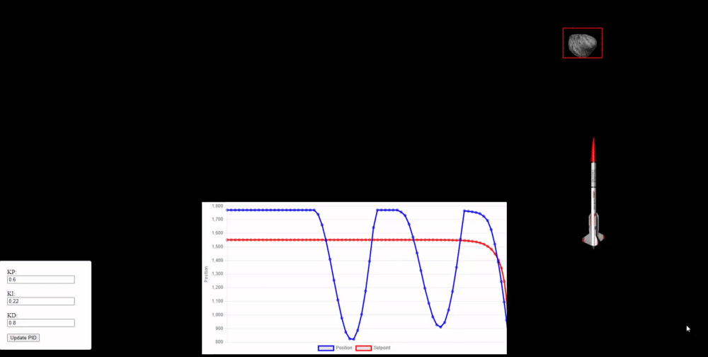

# PID control of distance delta from given set point

This is an extension of a simple JS game on YouTube that lets the user control a rocket with the mouse and shoot asteroids.

Implemented here is a PID control loop to automatically center the rocket based on the difference in x positions of the entities.

Firing is still done manually, with the spacebar. Adjsut the PID variables in the control panel to tune the loop.

